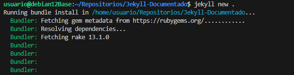
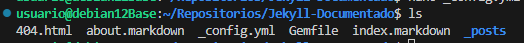
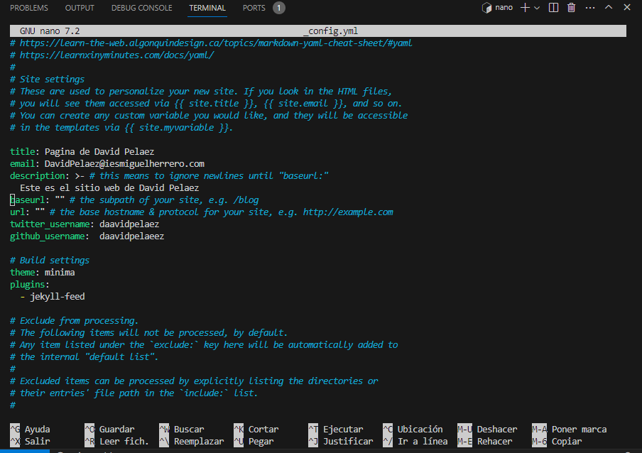
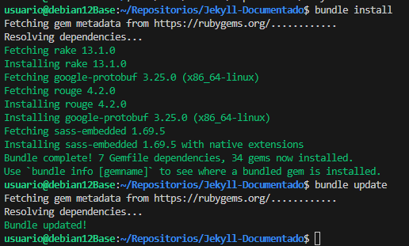
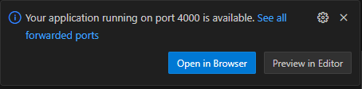
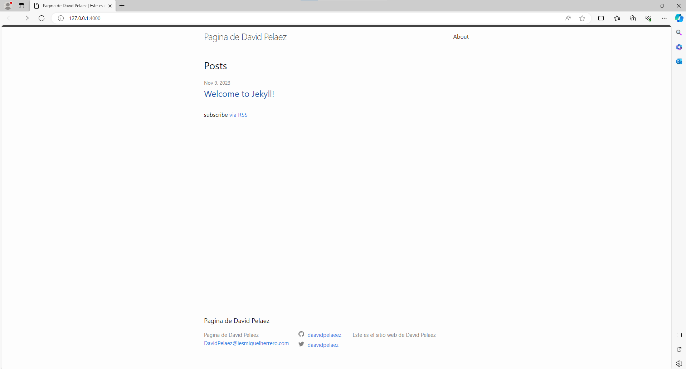
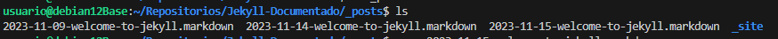
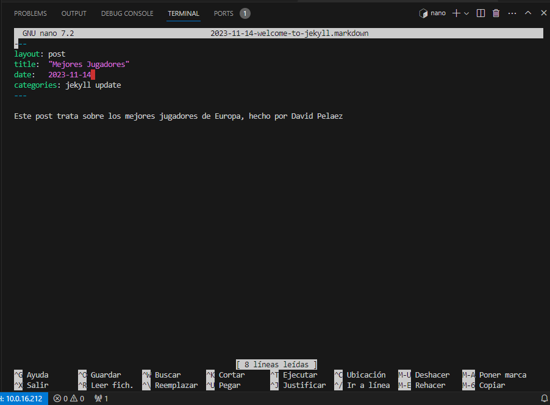
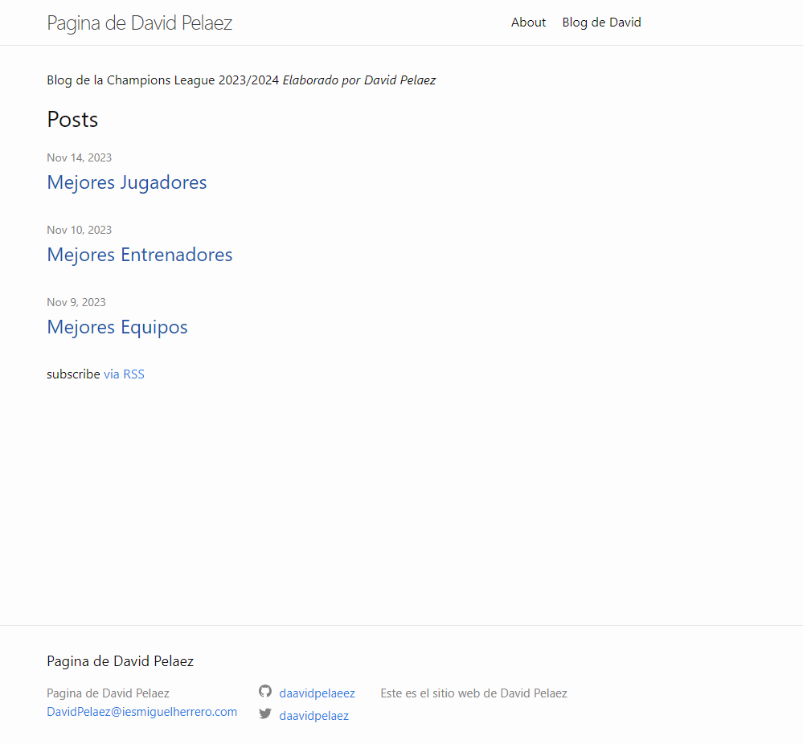

# Jekyll Documentado

## Instalacion previa
A continuacion procederemos a la instalacion basica de Jekyll. Antes de todo lo que voy a documentar deberemos haber configurado la red e instalar todo lo necesario para poder ejecutar Jekyll.

## Primer Paso - *CREACION DEL SITIO WEB EN JEKYLL*

    Jekyll new . (Para que cree el sitio en el directorio actual)
 

Se crean los siguientes archivos
 
## Segundo Paso - *CONFIGURACION DE FICHEROS*

Si deseas configurar el sitio, hay que abrir y configurar el archivo:
_config.yml para personalizar tu sitio.

    nano _config.yml

Instalamos y actualizamos bundle con los siguientes comandos

    bundle install
    bundle update

 

## Tercer Paso - *PRUEBA DEL SITIO EN LOCAL*

Lanzamos el sitio web con el siguiente comando:

    jekyll server 

Si estamos en VisualStudio nos saldra un mensaje de que el sitio esta siendo lanzado correctamente y el puerto en el que se encuentra. (En este caso el 4000)

 

Le daremos a abrir en el buscador para previsualizar lo que editamos en el config_yml previamente.

 
Efectivamente los cambios se han realizado correctamente, ahora seguiremos editando mas a fondo el sitio web.

## Cuarto Paso - *AGREGAR CONTENIDO AL SITIO WEB*

Editamos el fichero index.markdown para agregar contenido a la web

    nano index.markdown

 

## Quinto Paso - *AGREGAR PAGINA Y POSTS*

Para crear una pagina,creamos un markdown en mi caso va ser blog.markdown y le introducimos los valores.

Asi es como quedaria en la pagina web

Ahora para crear los posts deberemos de ir a la siguiente ruta y crear los que veamos necesarios ordenados por fecha. Dentro podremos editar el contenido de los posts, es importante que en el layout sea post como en paginas el layout es page.

